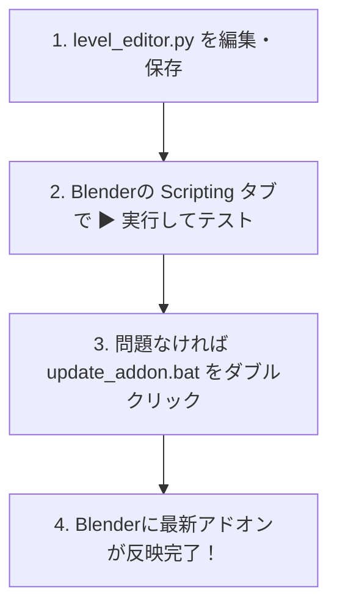

# レベルエディタ (TL1) 開発ヘルプ＆マニュアル

本ドキュメントは、プロジェクト `TL1` の開発手順および各種スクリプトの役割をまとめたマニュアルです。迷った際はこちらをご確認ください。

---

## 1. 開発の基本フロー

1. **コードの編集**:
   - [level_editor.py](file:///c:/Users/casa0/OneDrive/%E3%83%87%E3%82%B9%E3%82%AF%E3%83%88%E3%83%83%E3%83%97/TL1/level_editor.py) をVS Code等のエディタで編集・保存します。

2. **Blender上での即時テスト**:
   - Blenderの「Scripting（スクリプト作成）」ワークスペースを開きます。
   - `level_editor.py` を開いて **`▶`（スクリプト実行 / Alt+P）** を押し、動作テストを行います。

3. **Blender本体へのアドオン反映（最新化）**:
   - 動作確認ができたら、[update_addon.bat](file:///c:/Users/casa0/OneDrive/%E3%83%87%E3%82%B9%E3%82%AF%E3%83%88%E3%83%83%E3%83%97/TL1/update_addon.bat) をダブルクリックします。
   - 確認画面（UAC）で「はい」を押すと、Blenderのシステムフォルダ（`addons_core`）へ一瞬で上書き適用されます。

---

## 2. 主なファイルとスクリプトの役割

* **[level_editor.py](file:///c:/Users/casa0/OneDrive/%E3%83%87%E3%82%B9%E3%82%AF%E3%83%88%E3%83%83%E3%83%97/TL1/level_editor.py)**
  * アドオンのメインプログラムです。オペレータやメニューの定義を記述します。
* **[update_addon.bat](file:///c:/Users/casa0/OneDrive/%E3%83%87%E3%82%B9%E3%82%AF%E3%83%88%E3%83%83%E3%83%97/TL1/update_addon.bat)**
  * デスクトップ上の `level_editor.py` を Blenderのインストール先（`addons_core`）へ自動コピーして反映させるバッチファイルです。
* **[参考資料/instructions.md](file:///c:/Users/casa0/OneDrive/%E3%83%87%E3%82%B9%E3%82%AF%E3%83%88%E3%83%83%E3%83%97/TL1/%E5%8F%82%E8%80%83%E8%B3%87%E6%96%99/instructions.md)**
  * AIアシスタントとの進め方・解説フォーマット等を規定した開発指示書です。

---

## 3. よくあるトラブルと対処法

* **メニューに古いボタンしか表示されない / 反映されない場合**
  * `update_addon.bat` を実行した後、Blenderの `編集` ➔ `プリファレンス` ➔ `アドオン` で「レベルエディタ」のチェックを一度OFFにしてからONにし直すか、Blenderを再起動してください。

* **「`NameError: name 'classes' is not defined`」が出た場合**
  * `level_editor.py` の最下部に `if __name__ == "__main__": register()` が配置されているか確認してください。
